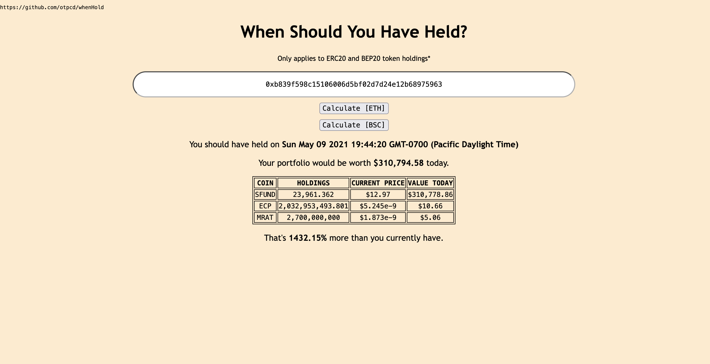

# When Should You Have Held?

This WebApp takes in an Ethereum wallet address and analyzes every transaction to determine at which point, if any, would have been a better time to stop trading ERC-20 tokens based on a comparison between the portfolio value now and the hypothetical portfolio value at every transaction.

Unfortunately due to the limitations of the Etherscan API regarding Ether balance at any given point in time (block number), I am unable to include ETH holdings in this calculation.  The Etherscan API only allows 2 API calls/second for this particular feature, and most wallets would need 100s or 1000s of these calls.

Powered by Etherscan and CoinGecko APIs.
