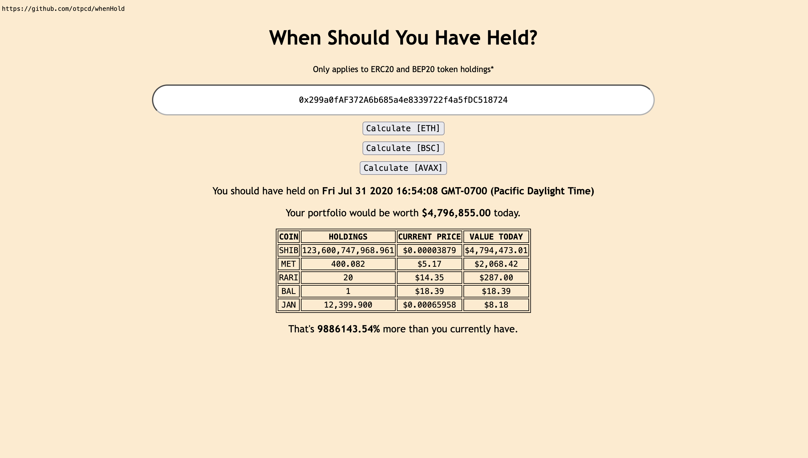

# When Should You Have Held?

This webapp analyzes a wallet address on the Ethereum blockchain and returns the date and time at which the wallet owner should have stopped making any transactions for maximum portfolio value.

Powered by Etherscan and CoinGecko APIs.
